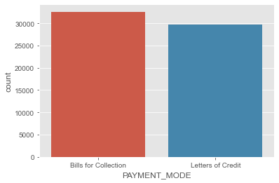
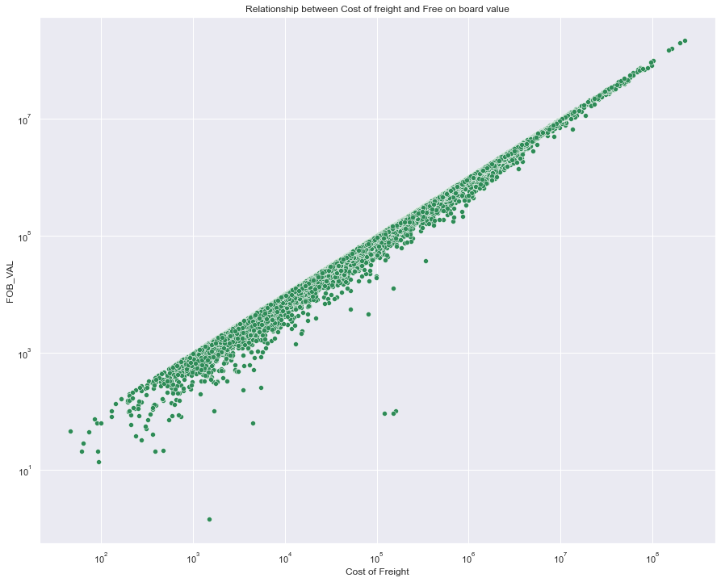
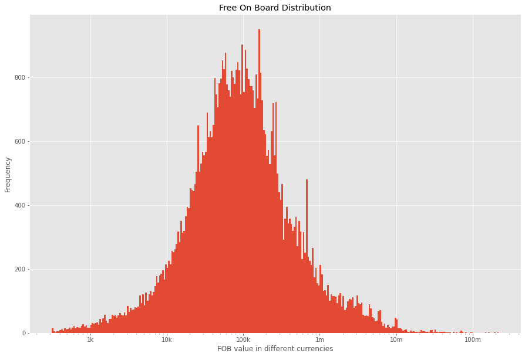
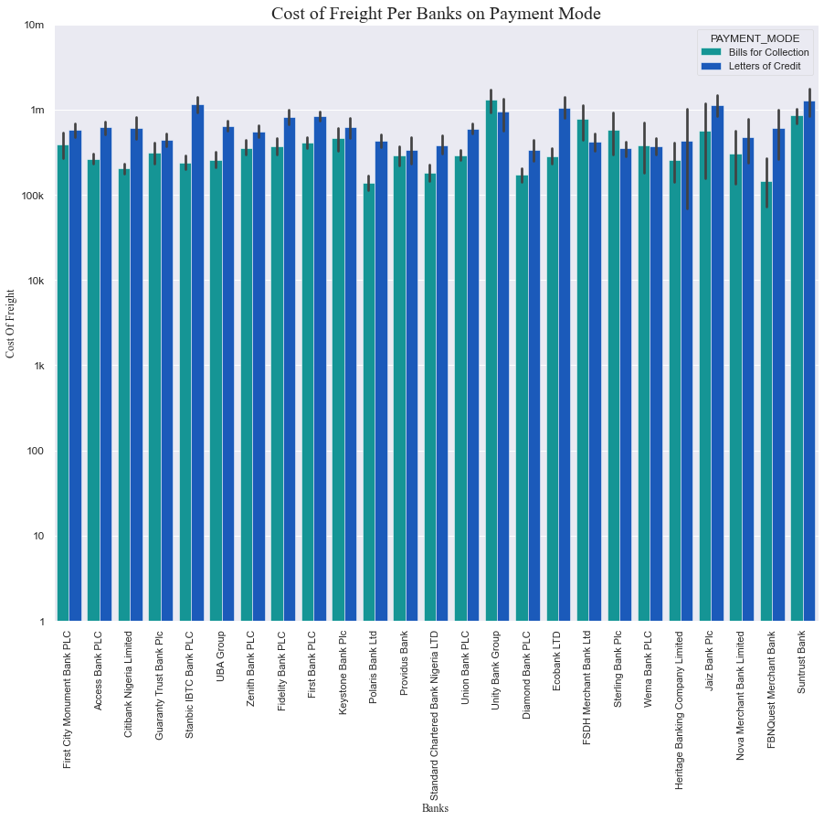

# (Exploring the 2019 Nigerian Import Data)
## by (Ayobami Alaran)

## Problem Statement
No good understanding of the dataset and can't ascertain the veracity fo the dataset to obtain unbias insights

## Solution 
Explore the dataset visually to confirm the veracity of the dataset so as to obtain bias free insights

## Analytical goals
>- Assess and clean the dataset
>- Explore the structure of the dataset visually
>- Perform univariate, bi-variate and Multi-variate visual exploration on the dataset to obtain insights 
Click the Analysis link for the analysis
<ul>
<li><a href="#analysis">Analysis</a></li>
</ul>

## Dataset

The data contains all basic information of goods importation to Nigeria, which consist of importers name, Freight value, cost of freight, exchange rate, importers and exporters details and so on  The was downloaded from kaggle.
For more info on the dataset[click here!](https://www.kaggle.com/datasets/godwinabah/2019-nigerian-import-data)

## Summary of Findings

>- Although bills for collection for payment mode seems to be more common than letters for credit, but after some further investigations that is true but letters for credit are mostly used for high cost of freight

>- From the exploration it was revealed that there is a strong positive relationship between cost of freight and fob val after using logarithmic scale for x and y axis, that is the higher the cost of freight the higher the fob value, however further analysis can be done to test the significance of the correlation.

## Key Insights for Presentation

For presentation i focused on the frequency distribution of fob values and the relationship between free on board and 
freight values as well as cost of freight on payment mode across the banks

## Project Help Sources
For the completion of this project, study research was carried to get better understanding of most of the used tools and visuals
help and more info was obtained from different sources and resourses such as Datacamp, ibm skills network, python for datascience handbook, Data visualisation with python ebook, udacity data analysis classroom, stackoverflow and geeks4geeks
